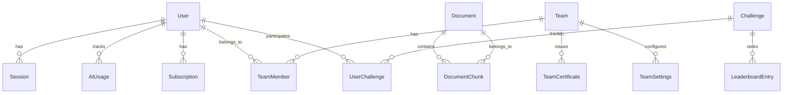

# Database Architecture Documentation

## Overview

The database architecture is built on SQLite (development) and Turso (production) using Prisma as the ORM. The schema is modular and designed to support a comprehensive learning platform with user management, content delivery, subscriptions, and AI-powered features.

## Database Configuration

### Environment Setup

```env
# Development (SQLite)
DATABASE_URL="file:./dev.db"

# Production (Turso)
TURSO_DATABASE_URL="libsql://your-database.turso.io"
TURSO_AUTH_TOKEN="your-auth-token"
```

### Prisma Configuration

```typescript
// Database adapter configuration
const databaseConfig = isDev
  ? { url: DEV_DB_URL }
  : {
      url: LOCAL_DB_URL,
      syncUrl: TURSO_DATABASE_URL,
      authToken: TURSO_AUTH_TOKEN,
      syncInterval: 60,
    };

const adapter = new PrismaLibSQL(databaseConfig);
```

## Schema Architecture

### Core Modules

The database schema is organized into logical modules:

1. **User Management** (`schema.prisma`)
2. **Content Management** (`content.prisma`)
3. **RAG System** (`rag.prisma`)
4. **AI Usage Tracking** (`ai.prisma`)
5. **Subscription Management** (`subscription.prisma`)
6. **Team Management** (`team.prisma`)
7. **Challenge System** (`challenge.prisma`)

### Schema Relationships



## Core Models

### User Management

#### User Model

```sql
model User {
  id                    String    @id @default(ulid())
  email                 String    @unique
  name                  String?
  username              String?   @unique
  imageUrl              String?
  isSubscribed          Boolean   @default(false)
  plan                  Plan      @default(basic)
  subscriptionType      SubscriptionType @default(individual)
  lastSeenAt            DateTime  @default(now())
  createdAt             DateTime  @default(now())
  updatedAt             DateTime  @updatedAt

  // Relations
  password              Password?
  sessions              Session[]
  image                 Image?
  teams                 TeamMember[]
  subscriptions         Subscription[]
  aiUsage               AIUsage[]
  userChallenges        UserChallenge[]
  challengeBadges       UserChallengeBadge[]
  leaderboardEntries    LeaderboardEntry[]
}
```

#### Session Management

```sql
model Session {
  id             String   @id @default(ulid())
  expirationDate DateTime
  createdAt      DateTime @default(now())
  updatedAt      DateTime @updatedAt
  userId         String

  @@index([userId])
}

model Password {
  hash   String
  userId String @unique
}
```

### Content Management

#### Image Storage

```sql
model Image {
  id       String    @id @default(cuid())
  fileKey  String
  filePath ImagePath @default(users)
  altText  String?
  createdAt DateTime @default(now())
  updatedAt DateTime @updatedAt

  // Relations
  user   User?  @relation(fields: [userId], references: [id])
  userId String @unique

  team   Team?  @relation(fields: [teamId], references: [id])
  teamId String @unique
}
```

### RAG System

#### Document Storage

```sql
model Document {
  id        String          @id @default(ulid())
  title     String
  source    String?
  content   String
  createdAt DateTime        @default(now())
  updatedAt DateTime        @updatedAt
  chunks    DocumentChunk[]
}

model DocumentChunk {
  id         String    @id @default(ulid())
  chunkType  ChunkType @default(TEXT)
  chunkIndex Int
  embedding  Bytes
  metadata   Json?
  document   Document  @relation(fields: [documentId], references: [id])
  documentId String
  content    String
  createdAt  DateTime  @default(now())
  updatedAt  DateTime  @updatedAt

  @@index([documentId])
  @@index([documentId, chunkIndex])
}
```

### AI Usage Tracking

#### Usage Monitoring

```sql
model AIUsage {
  id           String      @id @default(ulid())
  userId       String
  user         User        @relation(fields: [userId], references: [id])
  type         AIUsageType @default(learning_assistant)
  prompt       String
  response     String?
  tokensUsed   Int         @default(0)
  costInCents  Int         @default(0)
  success      Boolean     @default(true)
  errorMessage String?
  usageMonth   String
  createdAt    DateTime    @default(now())
  updatedAt    DateTime    @updatedAt

  @@index([userId])
  @@index([usageMonth])
  @@index([createdAt])
}
```

### Subscription Management

#### Subscription Tracking

```sql
model Subscription {
  id                String           @id @default(ulid())
  subscriptionId    String           @unique
  userId            String?
  teamId            String?
  status            SubscriptionStatus
  type              SubscriptionType
  plan              Plan
  amount            Int
  currency          String           @default("USD")
  currentPeriodStart DateTime?
  currentPeriodEnd   DateTime?
  createdAt         DateTime         @default(now())
  updatedAt         DateTime         @updatedAt

  @@index([userId])
  @@index([teamId])
  @@index([status])
}
```

### Team Management

#### Team Structure

```sql
model Team {
  id          String    @id @default(ulid())
  name        String
  description String?
  createdAt   DateTime  @default(now())
  updatedAt   DateTime  @updatedAt

  // Relations
  members     TeamMember[]
  image       Image?
  certificates TeamCertificate[]
  settings    TeamSettings?
}

model TeamMember {
  id       String   @id @default(ulid())
  role     TeamRole @default(member)
  joinedAt DateTime @default(now())

  // Relations
  user     User     @relation(fields: [userId], references: [id])
  userId   String
  team     Team     @relation(fields: [teamId], references: [id])
  teamId   String

  @@unique([userId, teamId])
  @@index([userId])
  @@index([teamId])
}
```

### Challenge System

#### Challenge Management

```sql
model Challenge {
  id          String    @id @default(ulid())
  title       String
  description String
  difficulty  ChallengeDifficulty
  startDate   DateTime
  endDate     DateTime
  isActive    Boolean   @default(true)
  createdAt   DateTime  @default(now())
  updatedAt   DateTime  @updatedAt

  // Relations
  participants UserChallenge[]
  leaderboard  LeaderboardEntry[]
  badges       Badge[]
}

model UserChallenge {
  id          String    @id @default(ulid())
  score       Int       @default(0)
  completedAt DateTime?
  createdAt   DateTime  @default(now())
  updatedAt   DateTime  @updatedAt

  // Relations
  user        User      @relation(fields: [userId], references: [id])
  userId      String
  challenge   Challenge @relation(fields: [challengeId], references: [id])
  challengeId String

  @@unique([userId, challengeId])
  @@index([userId])
  @@index([challengeId])
}
```

## Indexes and Performance

### Primary Indexes

```sql
-- User lookups
@@index([email])
@@index([username])

-- Session management
@@index([userId])
@@index([expirationDate])

-- AI usage tracking
@@index([userId])
@@index([usageMonth])
@@index([createdAt])

-- Subscription queries
@@index([userId])
@@index([teamId])
@@index([status])

-- RAG system
@@index([documentId])
@@index([documentId, chunkIndex])

-- Team management
@@index([userId])
@@index([teamId])
@@unique([userId, teamId])

-- Challenge system
@@index([userId])
@@index([challengeId])
@@unique([userId, challengeId])
```

### Query Optimization

```typescript
// Optimized user queries
const user = await prisma.user.findUnique({
  where: { id: userId },
  select: {
    id: true,
    email: true,
    name: true,
    isSubscribed: true,
    plan: true,
    _count: {
      select: {
        sessions: {
          where: { expirationDate: { gt: new Date() } },
        },
      },
    },
  },
});

// Efficient AI usage queries
const monthlyUsage = await prisma.aIUsage.count({
  where: {
    userId,
    usageMonth: new Date().toISOString().slice(0, 7),
  },
});
```

## Data Flow Patterns

### User Registration Flow

```typescript
// 1. Create user
const user = await prisma.user.create({
  data: {
    email,
    name,
    username,
    imageUrl,
  },
});

// 2. Create session
const session = await prisma.session.create({
  data: {
    userId: user.id,
    expirationDate: new Date(Date.now() + 30 * 24 * 60 * 60 * 1000), // 30 days
  },
});

// 3. Create profile image (if provided)
if (imageUrl) {
  await prisma.image.create({
    data: {
      userId: user.id,
      fileKey: imageKey,
      filePath: "users",
    },
  });
}
```

### Subscription Management Flow

```typescript
// 1. Create subscription
const subscription = await prisma.subscription.create({
  data: {
    subscriptionId: polarSubscriptionId,
    userId,
    status: "active",
    type: "individual",
    plan: "premium",
    amount: 900, // $9.00 in cents
    currentPeriodStart: new Date(),
    currentPeriodEnd: new Date(Date.now() + 30 * 24 * 60 * 60 * 1000),
  },
});

// 2. Update user subscription status
await prisma.user.update({
  where: { id: userId },
  data: {
    isSubscribed: true,
    plan: "premium",
  },
});
```

### RAG Document Processing Flow

```typescript
// 1. Create document
const document = await prisma.document.create({
  data: {
    title,
    content,
    source,
  },
});

// 2. Process chunks and embeddings
const chunks = await processDocumentChunks(content);
for (const chunk of chunks) {
  await prisma.documentChunk.create({
    data: {
      documentId: document.id,
      content: chunk.content,
      chunkIndex: chunk.index,
      embedding: chunk.embedding,
      metadata: chunk.metadata,
    },
  });
}
```

## Migration Strategy

### Schema Evolution

```typescript
// Example migration for adding new fields
model User {
  // Existing fields...
  newField String? // Add new optional field
}

// Migration file
-- AlterTable
ALTER TABLE "User" ADD COLUMN "newField" TEXT;
```

### Data Migration Patterns

```typescript
// Batch processing for large datasets
export async function migrateUserData() {
  const batchSize = 100;
  let skip = 0;

  while (true) {
    const users = await prisma.user.findMany({
      take: batchSize,
      skip,
      select: { id: true, email: true },
    });

    if (users.length === 0) break;

    // Process batch
    await Promise.all(users.map((user) => processUser(user)));

    skip += batchSize;
  }
}
```

## Backup and Recovery

### Backup Strategy

```typescript
// Database backup configuration
const backupConfig = {
  frequency: "daily",
  retention: "30 days",
  location: "s3://backups/",
  encryption: true,
};

// Backup verification
export async function verifyBackup(backupId: string) {
  // Verify backup integrity
  // Test restore process
  // Validate data consistency
}
```

### Recovery Procedures

```typescript
// Point-in-time recovery
export async function restoreFromBackup(backupId: string, timestamp?: Date) {
  // Stop application
  // Restore database
  // Verify data integrity
  // Restart application
}
```

## Monitoring and Analytics

### Database Metrics

```typescript
// Query performance monitoring
const queryStats = new Map<string, { count: number; totalDuration: number }>();

client.$on("query", async (e) => {
  const duration = e.duration;
  const queryKey = e.query.split(/\s+/).slice(0, 3).join(" ");

  const stats = queryStats.get(queryKey) || { count: 0, totalDuration: 0 };
  stats.count++;
  stats.totalDuration += duration;
  queryStats.set(queryKey, stats);

  if (duration > 20) {
    console.warn(`Slow query: ${duration}ms - ${e.query}`);
  }
});
```

### Health Checks

```typescript
// Database health check
export async function checkDatabaseHealth() {
  try {
    await prisma.$queryRaw`SELECT 1`;
    return { status: "healthy", timestamp: new Date() };
  } catch (error) {
    return { status: "unhealthy", error: error.message, timestamp: new Date() };
  }
}
```

## Security Considerations

### Data Protection

```typescript
// Sensitive data encryption
export function encryptSensitiveData(data: string): string {
  // Implement encryption for sensitive fields
  return encryptedData;
}

// Data anonymization
export function anonymizeUserData(userId: string) {
  return prisma.user.update({
    where: { id: userId },
    data: {
      email: `user_${userId}@deleted.com`,
      name: "Deleted User",
      imageUrl: null,
    },
  });
}
```

### Access Control

```typescript
// Row-level security
export async function getUserData(userId: string, requestingUserId: string) {
  // Verify user has permission to access data
  if (userId !== requestingUserId && !isAdmin(requestingUserId)) {
    throw new Error("Unauthorized access");
  }

  return await prisma.user.findUnique({
    where: { id: userId },
  });
}
```

## Troubleshooting

### Common Issues

1. **Connection Timeouts**

   - Check network connectivity
   - Verify database URL
   - Monitor connection pool

2. **Performance Issues**

   - Analyze slow queries
   - Check index usage
   - Monitor resource usage

3. **Data Consistency**
   - Verify foreign key constraints
   - Check transaction isolation
   - Monitor data integrity

### Debug Tools

```typescript
// Enable query logging
const client = new PrismaClient({
  log: [
    { level: "query", emit: "event" },
    { level: "error", emit: "stdout" },
    { level: "warn", emit: "stdout" },
  ],
});

// Query analysis
export async function analyzeQuery(query: string) {
  const result = await prisma.$queryRaw`EXPLAIN QUERY PLAN ${query}`;
  return result;
}
```

## Related Files

- `prisma/schema/schema.prisma` - Main schema file
- `prisma/schema/rag.prisma` - RAG system schema
- `prisma/schema/ai.prisma` - AI usage tracking
- `prisma/schema/subscription.prisma` - Subscription management
- `prisma/schema/team.prisma` - Team management
- `prisma/schema/challenge.prisma` - Challenge system
- `app/utils/db.server.ts` - Database configuration
- `prisma/seed.ts` - Database seeding
